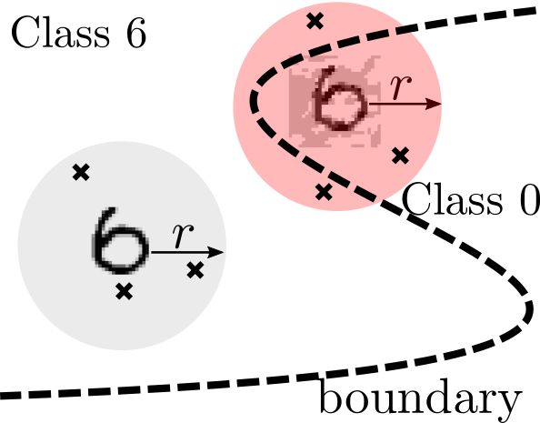
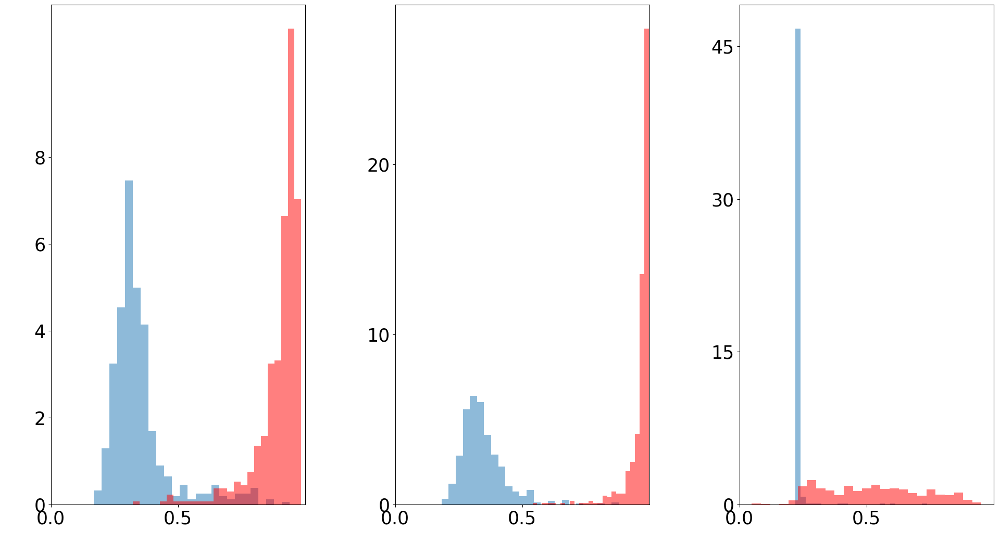

# zoNNscan:  boundary-entropy index for neural models

## Dependencies

This library requires TensorFlow (its installation will install also required scipy and numpy).
Keras is required to run the "hello world"-like example.

## Hello world example

Note that vars/ contains a MLP model (found on Keras examples) and trained on the MNIST database.

##### Execution
> $ python zoNNscan.py

> zoNNscan value on the MLP model and a random test example: 0.249815

## zoNNscan distribution of adversarial examples

Relative  distributions of zoNNscan values (x-axes) around  500  random  test  set  examples  (blue)  and  around the 500 adversarial examples generated from those test set examples  (red),  for  three Keras neural networks  (MLP,  CNN  and IRNN, from left to right, respectively).

Paper also tests zoNNscan for corner cases (neural network disagreements), and for a neural network watermarking technique.

## zoNNscan.py structure
Main function is zoNNscan(), which corresponds to Algorithm 1 in the paper. That function calls other procedures such as Monte Carlo sampling (sample_mmc()) and H_line() that returns the entropy per observation.

## Authors
Main developper was Adel Jaouen, maintained by Erwan Le Merrer.
